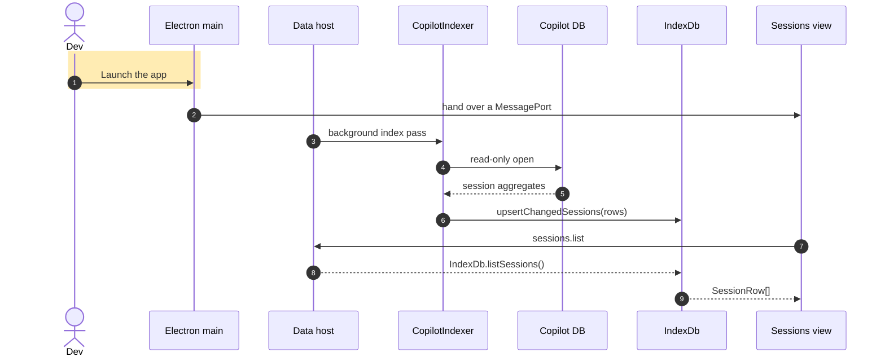

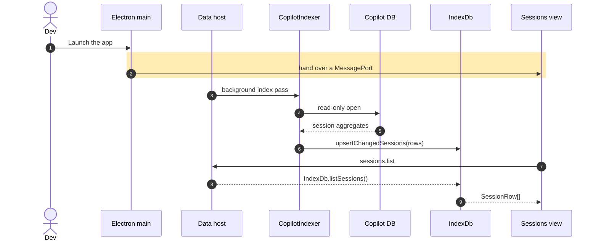

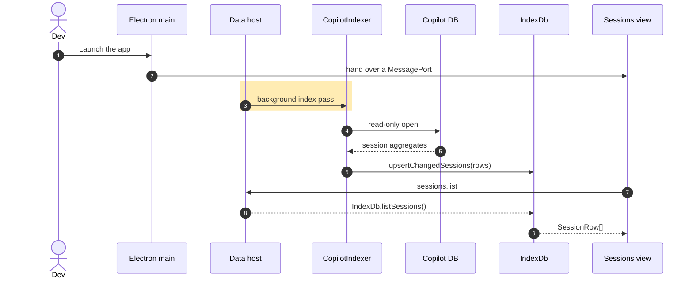

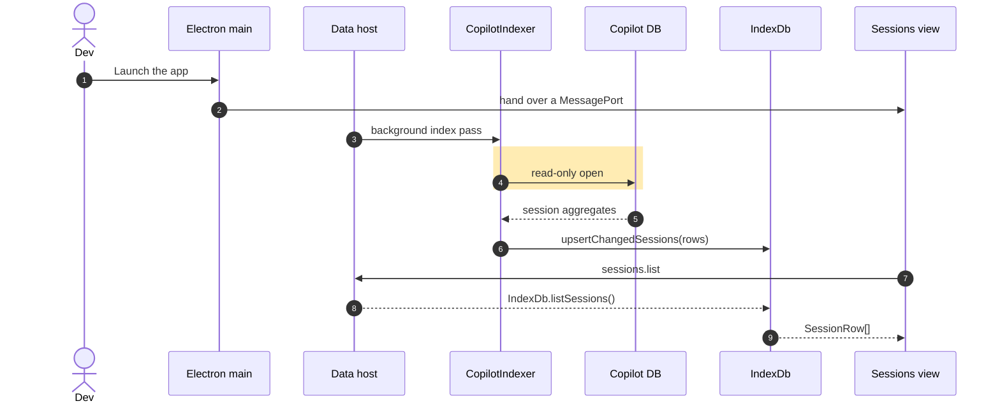

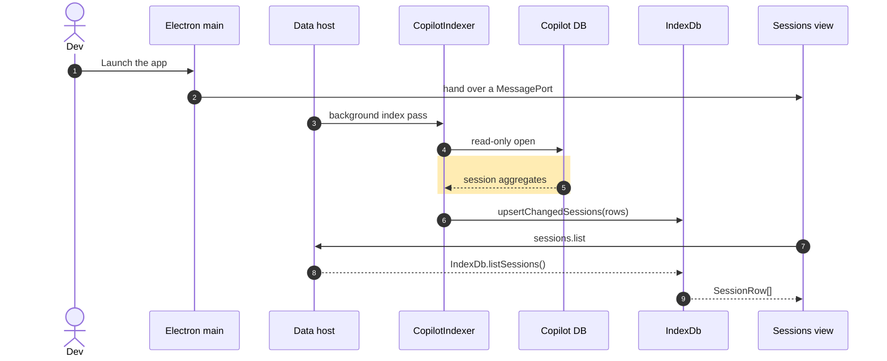

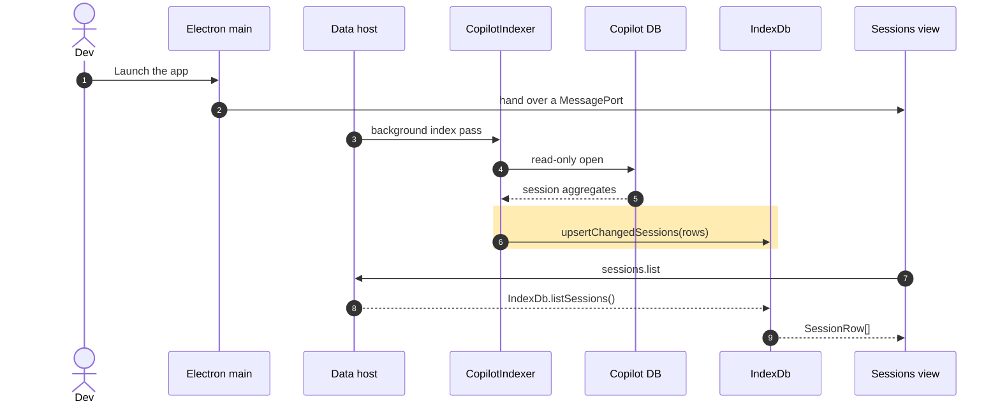

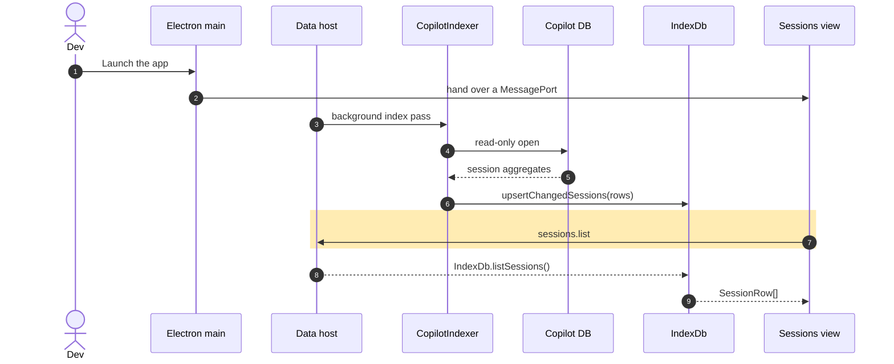

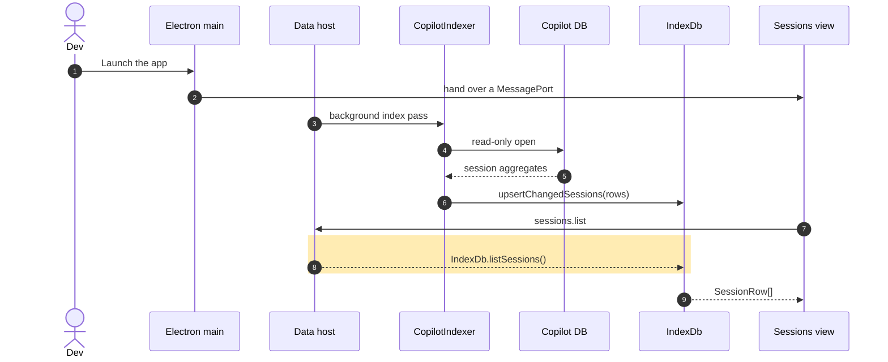

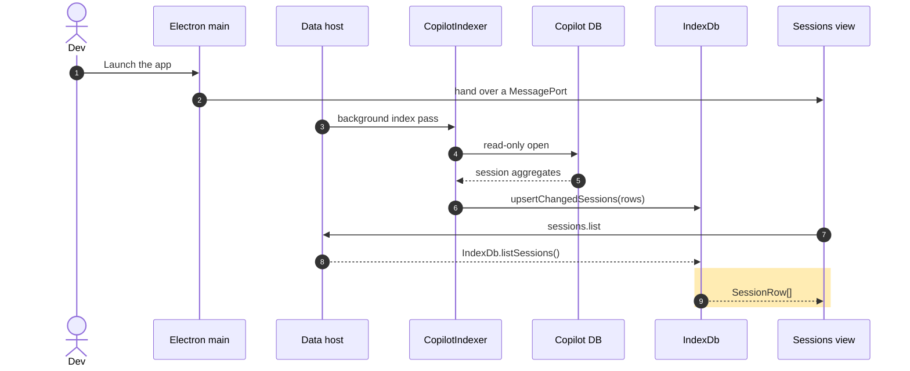

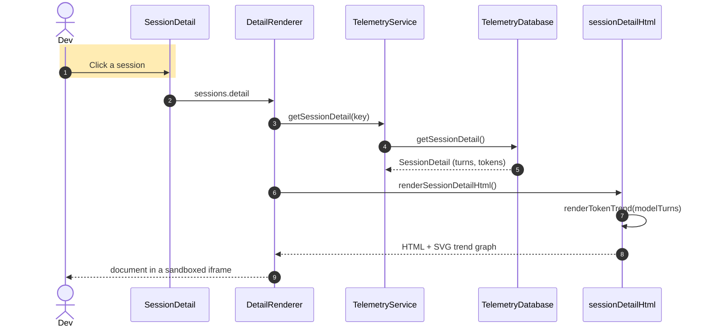

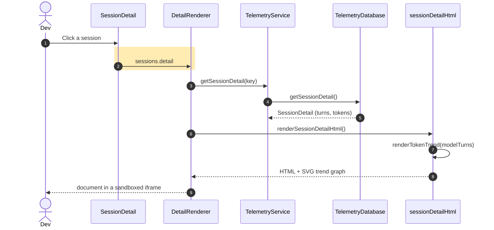

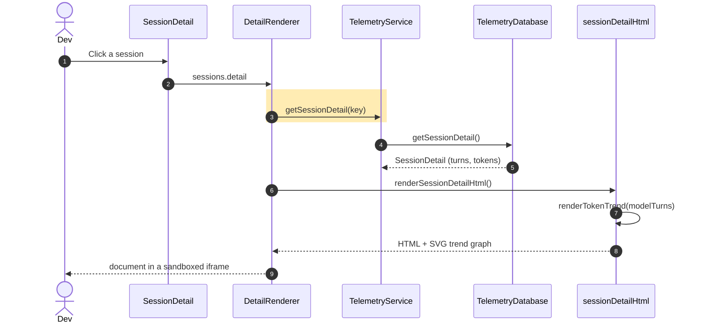

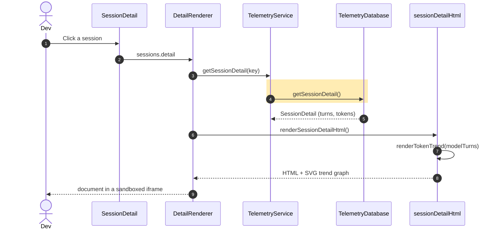

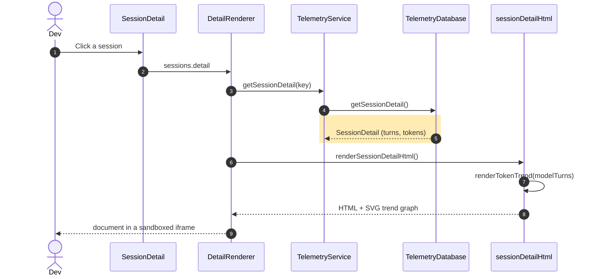

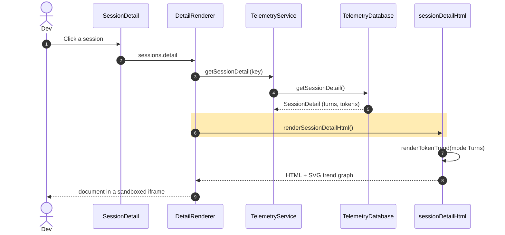

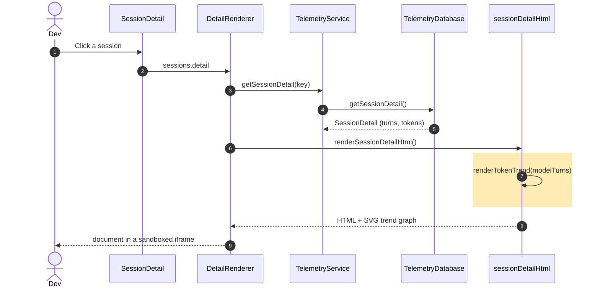

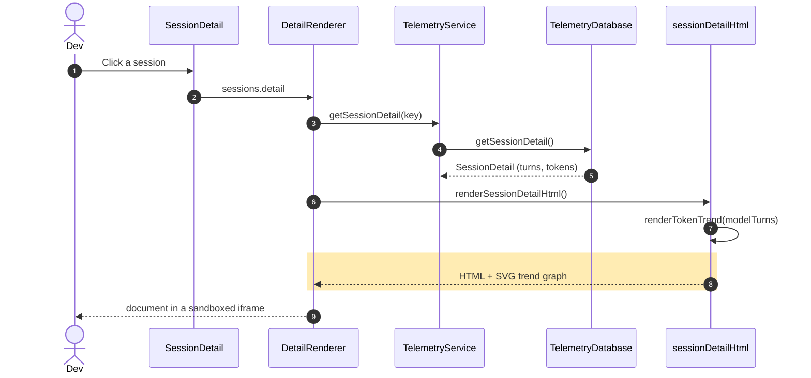

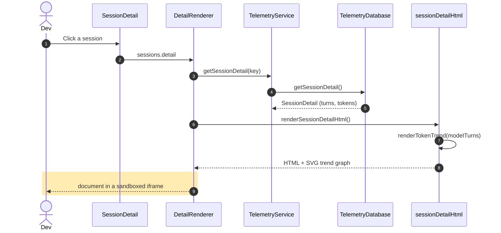

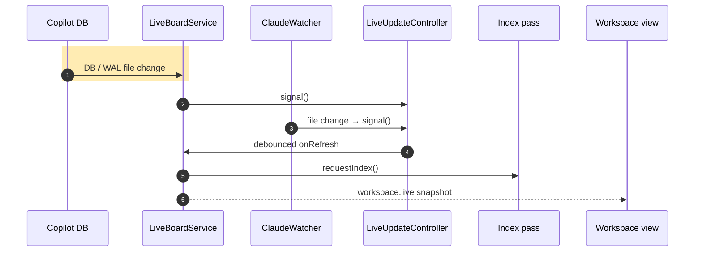

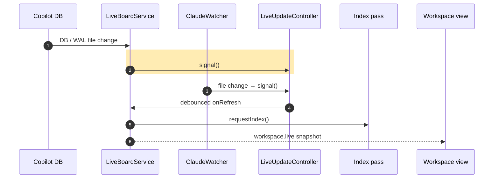

```mermaid
sequenceDiagram
    autonumber
    participant Cop as Copilot DB
    participant Board as LiveBoardService
    participant Watch as ClaudeWatcher
    participant Ctrl as LiveUpdateController
    participant Idx as Index pass
    participant View as Workspace view
    Cop->>Board: DB / WAL file change
    Board->>Ctrl: signal()
    rect rgb(255,236,179)
    Watch->>Ctrl: file change → signal()
    end
    Ctrl->>Board: debounced onRefresh
    Board->>Idx: requestIndex()
    Board-->>View: workspace.live snapshot
```

```mermaid
sequenceDiagram
    autonumber
    participant Cop as Copilot DB
    participant Board as LiveBoardService
    participant Watch as ClaudeWatcher
    participant Ctrl as LiveUpdateController
    participant Idx as Index pass
    participant View as Workspace view
    Cop->>Board: DB / WAL file change
    Board->>Ctrl: signal()
    Watch->>Ctrl: file change → signal()
    rect rgb(255,236,179)
    Ctrl->>Board: debounced onRefresh
    end
    Board->>Idx: requestIndex()
    Board-->>View: workspace.live snapshot
```

```mermaid
sequenceDiagram
    autonumber
    participant Cop as Copilot DB
    participant Board as LiveBoardService
    participant Watch as ClaudeWatcher
    participant Ctrl as LiveUpdateController
    participant Idx as Index pass
    participant View as Workspace view
    Cop->>Board: DB / WAL file change
    Board->>Ctrl: signal()
    Watch->>Ctrl: file change → signal()
    Ctrl->>Board: debounced onRefresh
    rect rgb(255,236,179)
    Board->>Idx: requestIndex()
    end
    Board-->>View: workspace.live snapshot
```

```mermaid
sequenceDiagram
    autonumber
    participant Cop as Copilot DB
    participant Board as LiveBoardService
    participant Watch as ClaudeWatcher
    participant Ctrl as LiveUpdateController
    participant Idx as Index pass
    participant View as Workspace view
    Cop->>Board: DB / WAL file change
    Board->>Ctrl: signal()
    Watch->>Ctrl: file change → signal()
    Ctrl->>Board: debounced onRefresh
    Board->>Idx: requestIndex()
    rect rgb(255,236,179)
    Board-->>View: workspace.live snapshot
    end
```

```mermaid
sequenceDiagram
    autonumber
    participant Panel as DetailRenderer
    participant Local as detectTurnDeviations
    participant Group as turnGrouping
    participant Det as WorkflowDeviationDetector
    participant Match as contentMatcher
    rect rgb(255,236,179)
    Panel->>Local: detectTurnDeviations(detail)
    end
    Local->>Group: groupInteractionsByTurn()
    Local->>Det: detectForTurnsWithDefaults()
    Det->>Match: matchesPredicate / content
    Match-->>Det: match result
    Det-->>Local: WorkflowDeviation[][]
    Local-->>Panel: markers rendered
```

```mermaid
sequenceDiagram
    autonumber
    participant Panel as DetailRenderer
    participant Local as detectTurnDeviations
    participant Group as turnGrouping
    participant Det as WorkflowDeviationDetector
    participant Match as contentMatcher
    Panel->>Local: detectTurnDeviations(detail)
    rect rgb(255,236,179)
    Local->>Group: groupInteractionsByTurn()
    end
    Local->>Det: detectForTurnsWithDefaults()
    Det->>Match: matchesPredicate / content
    Match-->>Det: match result
    Det-->>Local: WorkflowDeviation[][]
    Local-->>Panel: markers rendered
```

```mermaid
sequenceDiagram
    autonumber
    participant Panel as DetailRenderer
    participant Local as detectTurnDeviations
    participant Group as turnGrouping
    participant Det as WorkflowDeviationDetector
    participant Match as contentMatcher
    Panel->>Local: detectTurnDeviations(detail)
    Local->>Group: groupInteractionsByTurn()
    rect rgb(255,236,179)
    Local->>Det: detectForTurnsWithDefaults()
    end
    Det->>Match: matchesPredicate / content
    Match-->>Det: match result
    Det-->>Local: WorkflowDeviation[][]
    Local-->>Panel: markers rendered
```

```mermaid
sequenceDiagram
    autonumber
    participant Panel as DetailRenderer
    participant Local as detectTurnDeviations
    participant Group as turnGrouping
    participant Det as WorkflowDeviationDetector
    participant Match as contentMatcher
    Panel->>Local: detectTurnDeviations(detail)
    Local->>Group: groupInteractionsByTurn()
    Local->>Det: detectForTurnsWithDefaults()
    rect rgb(255,236,179)
    Det->>Match: matchesPredicate / content
    end
    Match-->>Det: match result
    Det-->>Local: WorkflowDeviation[][]
    Local-->>Panel: markers rendered
```

```mermaid
sequenceDiagram
    autonumber
    participant Panel as DetailRenderer
    participant Local as detectTurnDeviations
    participant Group as turnGrouping
    participant Det as WorkflowDeviationDetector
    participant Match as contentMatcher
    Panel->>Local: detectTurnDeviations(detail)
    Local->>Group: groupInteractionsByTurn()
    Local->>Det: detectForTurnsWithDefaults()
    Det->>Match: matchesPredicate / content
    rect rgb(255,236,179)
    Match-->>Det: match result
    end
    Det-->>Local: WorkflowDeviation[][]
    Local-->>Panel: markers rendered
```

```mermaid
sequenceDiagram
    autonumber
    participant Panel as DetailRenderer
    participant Local as detectTurnDeviations
    participant Group as turnGrouping
    participant Det as WorkflowDeviationDetector
    participant Match as contentMatcher
    Panel->>Local: detectTurnDeviations(detail)
    Local->>Group: groupInteractionsByTurn()
    Local->>Det: detectForTurnsWithDefaults()
    Det->>Match: matchesPredicate / content
    Match-->>Det: match result
    rect rgb(255,236,179)
    Det-->>Local: WorkflowDeviation[][]
    end
    Local-->>Panel: markers rendered
```

```mermaid
sequenceDiagram
    autonumber
    participant Panel as DetailRenderer
    participant Local as detectTurnDeviations
    participant Group as turnGrouping
    participant Det as WorkflowDeviationDetector
    participant Match as contentMatcher
    Panel->>Local: detectTurnDeviations(detail)
    Local->>Group: groupInteractionsByTurn()
    Local->>Det: detectForTurnsWithDefaults()
    Det->>Match: matchesPredicate / content
    Match-->>Det: match result
    Det-->>Local: WorkflowDeviation[][]
    rect rgb(255,236,179)
    Local-->>Panel: markers rendered
    end
```
