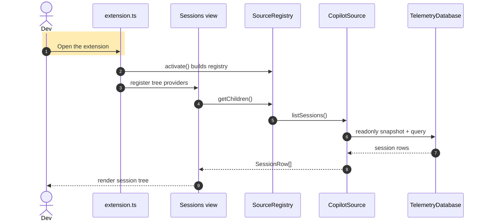

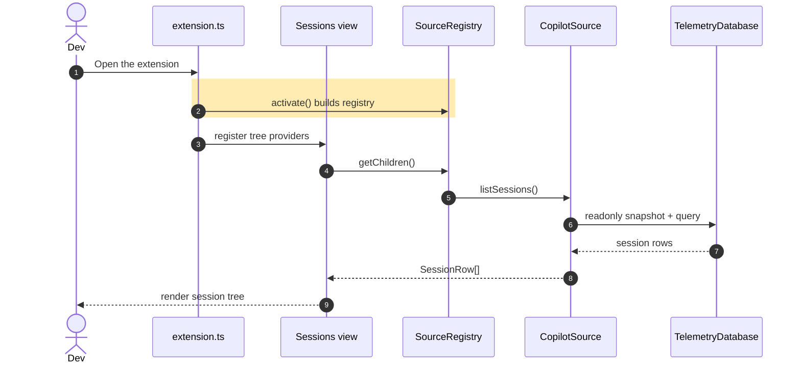

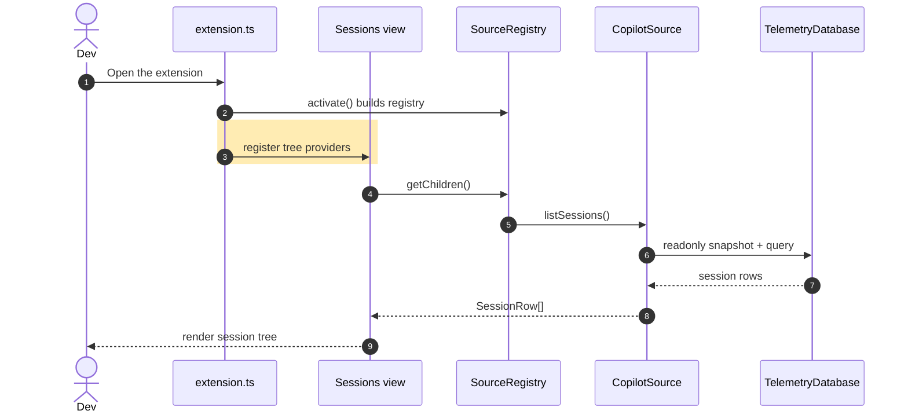

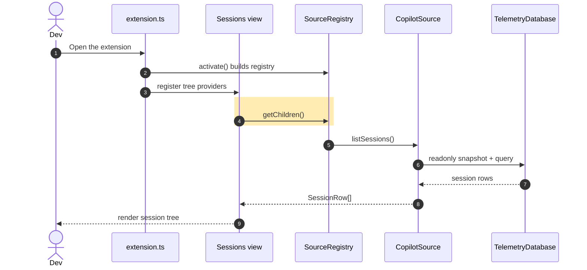

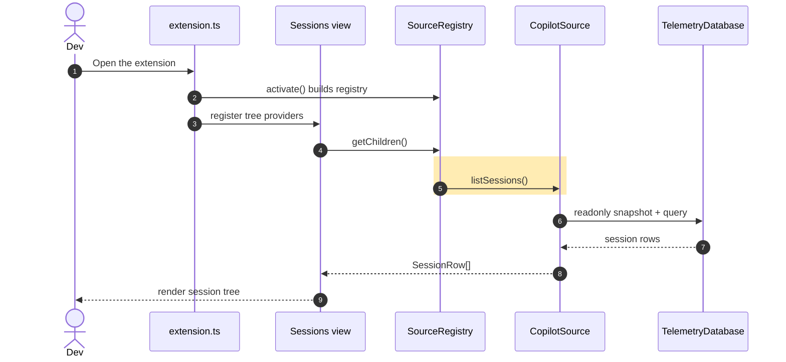

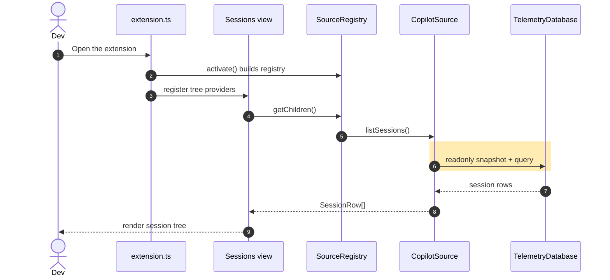

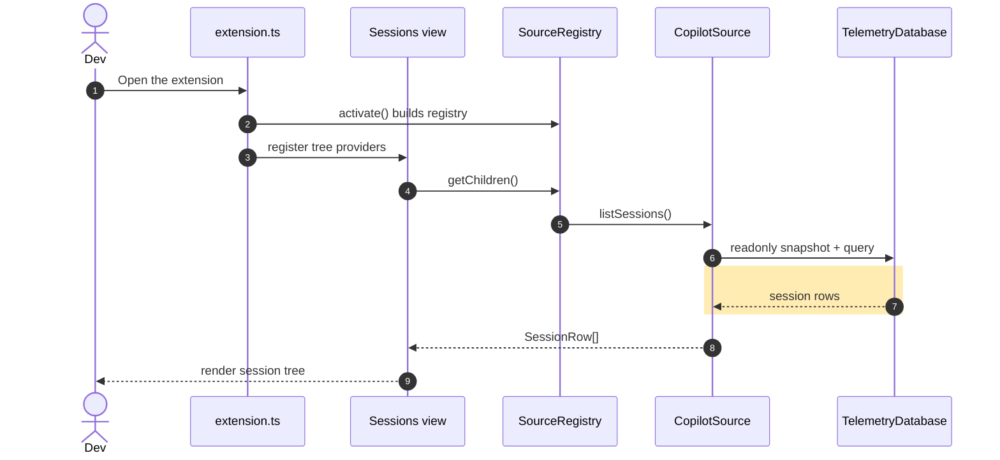

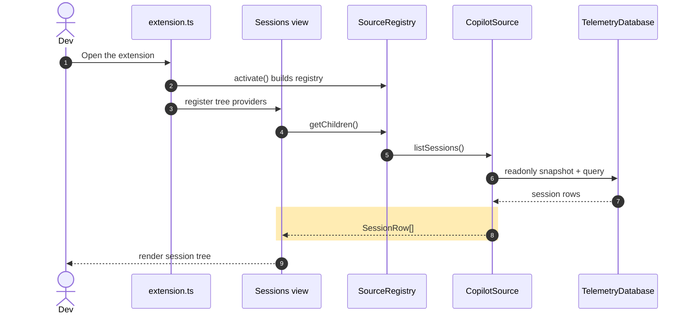

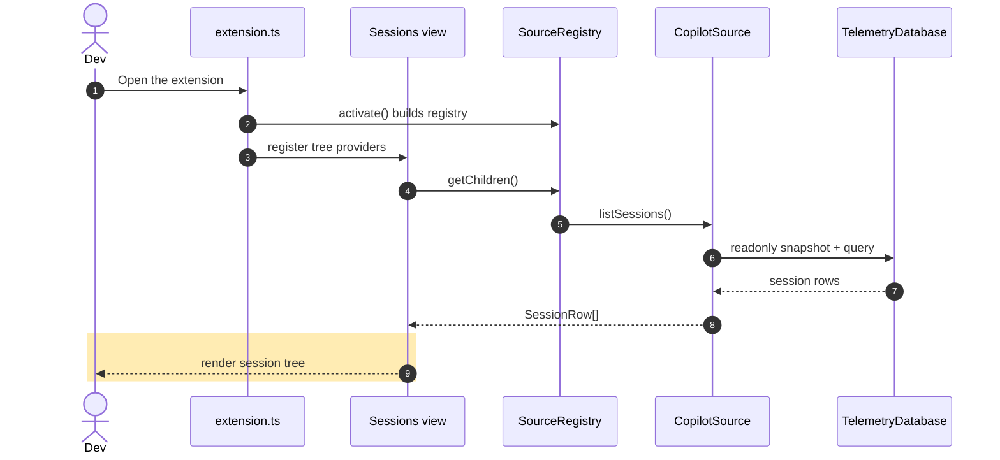

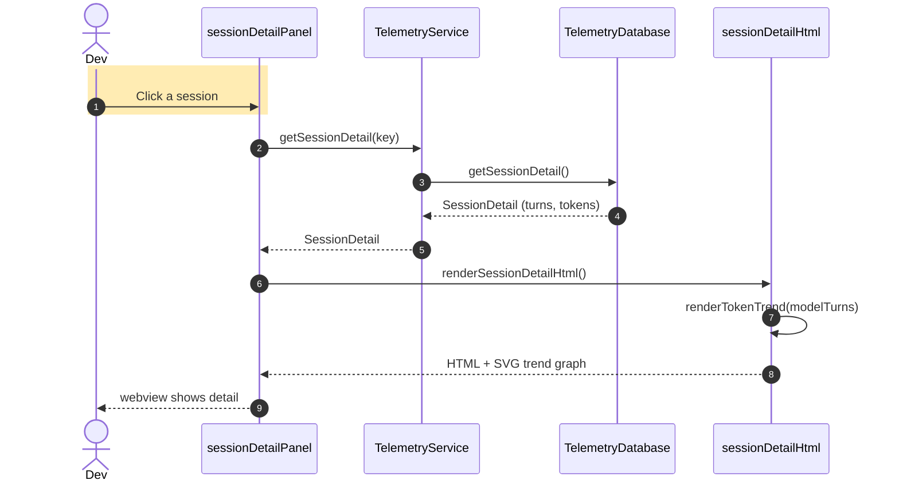

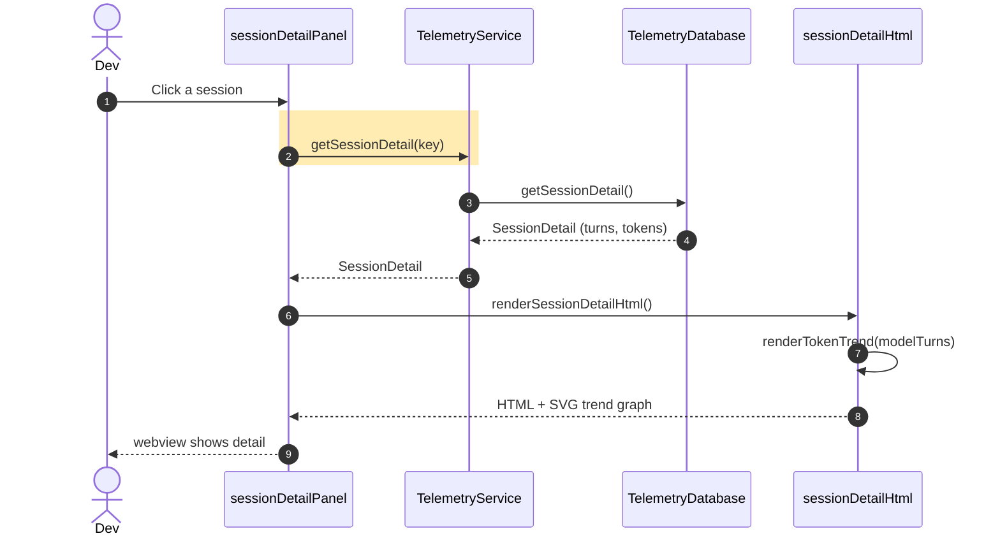

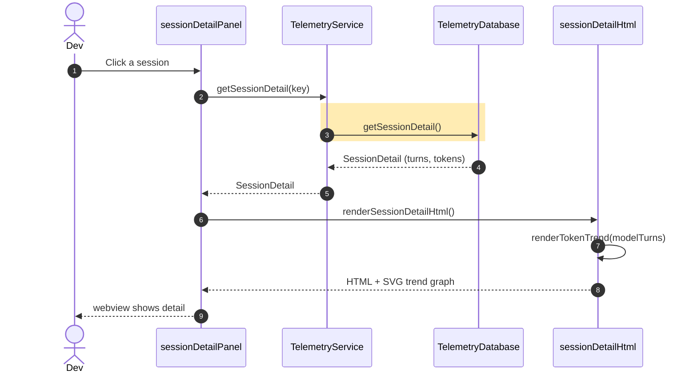


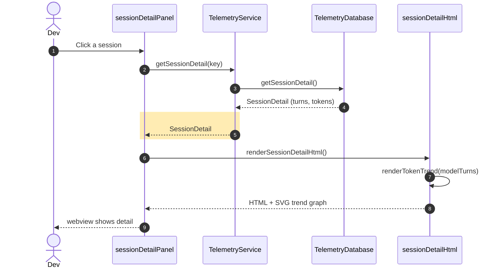

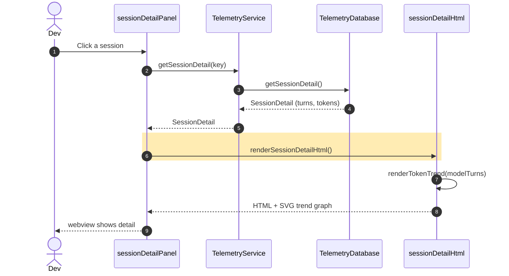

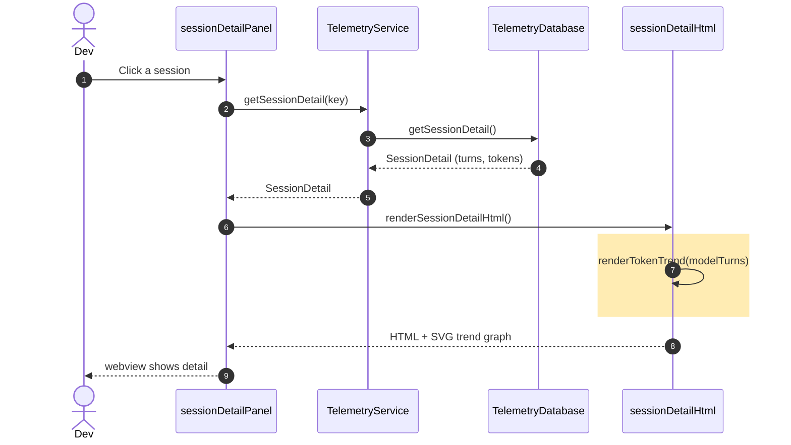

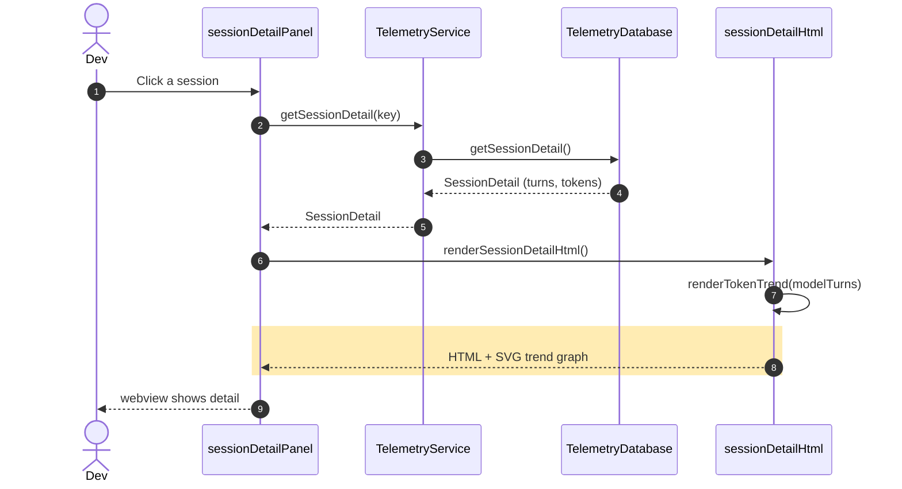

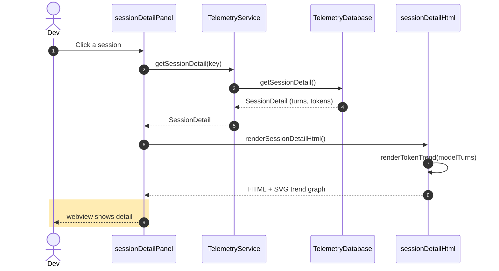

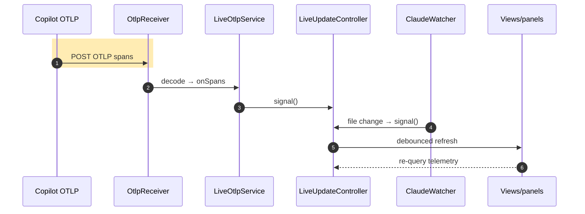

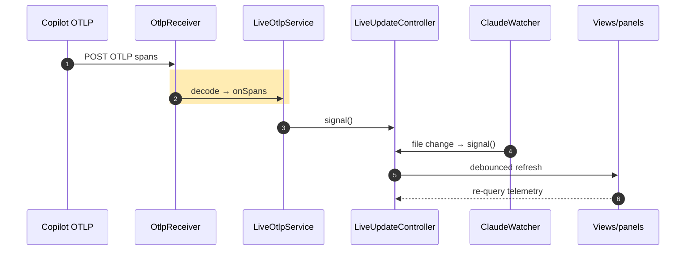

```mermaid
sequenceDiagram
    autonumber
    participant Cop as Copilot OTLP
    participant Recv as OtlpReceiver
    participant LiveS as LiveOtlpService
    participant Ctrl as LiveUpdateController
    participant Watch as ClaudeWatcher
    participant View as Views/panels
    Cop->>Recv: POST OTLP spans
    Recv->>LiveS: decode → onSpans
    rect rgb(255,236,179)
    LiveS->>Ctrl: signal()
    end
    Watch->>Ctrl: file change → signal()
    Ctrl->>View: debounced refresh
    View-->>Ctrl: re-query telemetry
```

```mermaid
sequenceDiagram
    autonumber
    participant Cop as Copilot OTLP
    participant Recv as OtlpReceiver
    participant LiveS as LiveOtlpService
    participant Ctrl as LiveUpdateController
    participant Watch as ClaudeWatcher
    participant View as Views/panels
    Cop->>Recv: POST OTLP spans
    Recv->>LiveS: decode → onSpans
    LiveS->>Ctrl: signal()
    rect rgb(255,236,179)
    Watch->>Ctrl: file change → signal()
    end
    Ctrl->>View: debounced refresh
    View-->>Ctrl: re-query telemetry
```

```mermaid
sequenceDiagram
    autonumber
    participant Cop as Copilot OTLP
    participant Recv as OtlpReceiver
    participant LiveS as LiveOtlpService
    participant Ctrl as LiveUpdateController
    participant Watch as ClaudeWatcher
    participant View as Views/panels
    Cop->>Recv: POST OTLP spans
    Recv->>LiveS: decode → onSpans
    LiveS->>Ctrl: signal()
    Watch->>Ctrl: file change → signal()
    rect rgb(255,236,179)
    Ctrl->>View: debounced refresh
    end
    View-->>Ctrl: re-query telemetry
```

```mermaid
sequenceDiagram
    autonumber
    participant Cop as Copilot OTLP
    participant Recv as OtlpReceiver
    participant LiveS as LiveOtlpService
    participant Ctrl as LiveUpdateController
    participant Watch as ClaudeWatcher
    participant View as Views/panels
    Cop->>Recv: POST OTLP spans
    Recv->>LiveS: decode → onSpans
    LiveS->>Ctrl: signal()
    Watch->>Ctrl: file change → signal()
    Ctrl->>View: debounced refresh
    rect rgb(255,236,179)
    View-->>Ctrl: re-query telemetry
    end
```

```mermaid
sequenceDiagram
    autonumber
    participant Timer as Sweep timer
    participant Arch as CopilotArchiver
    participant Lease as WriterLease
    participant Snap as readonly snapshot
    participant Store as Archive DB
    rect rgb(255,236,179)
    Timer->>Arch: start() / tick()
    end
    Arch->>Lease: tryAcquire() elect writer
    Lease-->>Arch: writer or reader
    Arch->>Store: open IngestStore(archive)
    Arch->>Snap: snapshot each Copilot source
    Snap-->>Arch: new spans above watermark
    Arch->>Store: write new spans
    Arch->>Store: prune(retention)
```

```mermaid
sequenceDiagram
    autonumber
    participant Timer as Sweep timer
    participant Arch as CopilotArchiver
    participant Lease as WriterLease
    participant Snap as readonly snapshot
    participant Store as Archive DB
    Timer->>Arch: start() / tick()
    rect rgb(255,236,179)
    Arch->>Lease: tryAcquire() elect writer
    end
    Lease-->>Arch: writer or reader
    Arch->>Store: open IngestStore(archive)
    Arch->>Snap: snapshot each Copilot source
    Snap-->>Arch: new spans above watermark
    Arch->>Store: write new spans
    Arch->>Store: prune(retention)
```

```mermaid
sequenceDiagram
    autonumber
    participant Timer as Sweep timer
    participant Arch as CopilotArchiver
    participant Lease as WriterLease
    participant Snap as readonly snapshot
    participant Store as Archive DB
    Timer->>Arch: start() / tick()
    Arch->>Lease: tryAcquire() elect writer
    rect rgb(255,236,179)
    Lease-->>Arch: writer or reader
    end
    Arch->>Store: open IngestStore(archive)
    Arch->>Snap: snapshot each Copilot source
    Snap-->>Arch: new spans above watermark
    Arch->>Store: write new spans
    Arch->>Store: prune(retention)
```

```mermaid
sequenceDiagram
    autonumber
    participant Timer as Sweep timer
    participant Arch as CopilotArchiver
    participant Lease as WriterLease
    participant Snap as readonly snapshot
    participant Store as Archive DB
    Timer->>Arch: start() / tick()
    Arch->>Lease: tryAcquire() elect writer
    Lease-->>Arch: writer or reader
    rect rgb(255,236,179)
    Arch->>Store: open IngestStore(archive)
    end
    Arch->>Snap: snapshot each Copilot source
    Snap-->>Arch: new spans above watermark
    Arch->>Store: write new spans
    Arch->>Store: prune(retention)
```

```mermaid
sequenceDiagram
    autonumber
    participant Timer as Sweep timer
    participant Arch as CopilotArchiver
    participant Lease as WriterLease
    participant Snap as readonly snapshot
    participant Store as Archive DB
    Timer->>Arch: start() / tick()
    Arch->>Lease: tryAcquire() elect writer
    Lease-->>Arch: writer or reader
    Arch->>Store: open IngestStore(archive)
    rect rgb(255,236,179)
    Arch->>Snap: snapshot each Copilot source
    end
    Snap-->>Arch: new spans above watermark
    Arch->>Store: write new spans
    Arch->>Store: prune(retention)
```

```mermaid
sequenceDiagram
    autonumber
    participant Timer as Sweep timer
    participant Arch as CopilotArchiver
    participant Lease as WriterLease
    participant Snap as readonly snapshot
    participant Store as Archive DB
    Timer->>Arch: start() / tick()
    Arch->>Lease: tryAcquire() elect writer
    Lease-->>Arch: writer or reader
    Arch->>Store: open IngestStore(archive)
    Arch->>Snap: snapshot each Copilot source
    rect rgb(255,236,179)
    Snap-->>Arch: new spans above watermark
    end
    Arch->>Store: write new spans
    Arch->>Store: prune(retention)
```

```mermaid
sequenceDiagram
    autonumber
    participant Timer as Sweep timer
    participant Arch as CopilotArchiver
    participant Lease as WriterLease
    participant Snap as readonly snapshot
    participant Store as Archive DB
    Timer->>Arch: start() / tick()
    Arch->>Lease: tryAcquire() elect writer
    Lease-->>Arch: writer or reader
    Arch->>Store: open IngestStore(archive)
    Arch->>Snap: snapshot each Copilot source
    Snap-->>Arch: new spans above watermark
    rect rgb(255,236,179)
    Arch->>Store: write new spans
    end
    Arch->>Store: prune(retention)
```

```mermaid
sequenceDiagram
    autonumber
    participant Timer as Sweep timer
    participant Arch as CopilotArchiver
    participant Lease as WriterLease
    participant Snap as readonly snapshot
    participant Store as Archive DB
    Timer->>Arch: start() / tick()
    Arch->>Lease: tryAcquire() elect writer
    Lease-->>Arch: writer or reader
    Arch->>Store: open IngestStore(archive)
    Arch->>Snap: snapshot each Copilot source
    Snap-->>Arch: new spans above watermark
    Arch->>Store: write new spans
    rect rgb(255,236,179)
    Arch->>Store: prune(retention)
    end
```

```mermaid
sequenceDiagram
    autonumber
    participant Panel as session detail
    participant Local as LocalDeviationDetector
    participant Group as turnGrouping
    participant Det as WorkflowDeviationDetector
    participant Match as contentMatcher
    rect rgb(255,236,179)
    Panel->>Local: detectForSession(turns)
    end
    Local->>Group: groupInteractionsByTurn()
    Local->>Det: detectForTurns(turns, config)
    Det->>Match: matchesPredicate / content
    Match-->>Det: match result
    Det-->>Local: WorkflowDeviation[]
    Local-->>Panel: markers rendered
```

```mermaid
sequenceDiagram
    autonumber
    participant Panel as session detail
    participant Local as LocalDeviationDetector
    participant Group as turnGrouping
    participant Det as WorkflowDeviationDetector
    participant Match as contentMatcher
    Panel->>Local: detectForSession(turns)
    rect rgb(255,236,179)
    Local->>Group: groupInteractionsByTurn()
    end
    Local->>Det: detectForTurns(turns, config)
    Det->>Match: matchesPredicate / content
    Match-->>Det: match result
    Det-->>Local: WorkflowDeviation[]
    Local-->>Panel: markers rendered
```

```mermaid
sequenceDiagram
    autonumber
    participant Panel as session detail
    participant Local as LocalDeviationDetector
    participant Group as turnGrouping
    participant Det as WorkflowDeviationDetector
    participant Match as contentMatcher
    Panel->>Local: detectForSession(turns)
    Local->>Group: groupInteractionsByTurn()
    rect rgb(255,236,179)
    Local->>Det: detectForTurns(turns, config)
    end
    Det->>Match: matchesPredicate / content
    Match-->>Det: match result
    Det-->>Local: WorkflowDeviation[]
    Local-->>Panel: markers rendered
```

```mermaid
sequenceDiagram
    autonumber
    participant Panel as session detail
    participant Local as LocalDeviationDetector
    participant Group as turnGrouping
    participant Det as WorkflowDeviationDetector
    participant Match as contentMatcher
    Panel->>Local: detectForSession(turns)
    Local->>Group: groupInteractionsByTurn()
    Local->>Det: detectForTurns(turns, config)
    rect rgb(255,236,179)
    Det->>Match: matchesPredicate / content
    end
    Match-->>Det: match result
    Det-->>Local: WorkflowDeviation[]
    Local-->>Panel: markers rendered
```

```mermaid
sequenceDiagram
    autonumber
    participant Panel as session detail
    participant Local as LocalDeviationDetector
    participant Group as turnGrouping
    participant Det as WorkflowDeviationDetector
    participant Match as contentMatcher
    Panel->>Local: detectForSession(turns)
    Local->>Group: groupInteractionsByTurn()
    Local->>Det: detectForTurns(turns, config)
    Det->>Match: matchesPredicate / content
    rect rgb(255,236,179)
    Match-->>Det: match result
    end
    Det-->>Local: WorkflowDeviation[]
    Local-->>Panel: markers rendered
```

```mermaid
sequenceDiagram
    autonumber
    participant Panel as session detail
    participant Local as LocalDeviationDetector
    participant Group as turnGrouping
    participant Det as WorkflowDeviationDetector
    participant Match as contentMatcher
    Panel->>Local: detectForSession(turns)
    Local->>Group: groupInteractionsByTurn()
    Local->>Det: detectForTurns(turns, config)
    Det->>Match: matchesPredicate / content
    Match-->>Det: match result
    rect rgb(255,236,179)
    Det-->>Local: WorkflowDeviation[]
    end
    Local-->>Panel: markers rendered
```

```mermaid
sequenceDiagram
    autonumber
    participant Panel as session detail
    participant Local as LocalDeviationDetector
    participant Group as turnGrouping
    participant Det as WorkflowDeviationDetector
    participant Match as contentMatcher
    Panel->>Local: detectForSession(turns)
    Local->>Group: groupInteractionsByTurn()
    Local->>Det: detectForTurns(turns, config)
    Det->>Match: matchesPredicate / content
    Match-->>Det: match result
    Det-->>Local: WorkflowDeviation[]
    rect rgb(255,236,179)
    Local-->>Panel: markers rendered
    end
```

```mermaid
sequenceDiagram
    autonumber
    actor Dev
    participant Live as Live update
    participant Notif as DivergenceNotifier
    participant Local as LocalDeviationDetector
    participant Code as VS Code UI
    rect rgb(255,236,179)
    Live->>Notif: refresh() after new data
    end
    Notif->>Local: scan() for divergences
    Local-->>Notif: new deviations vs baseline
    Notif->>Code: showWarningMessage()
    Code-->>Dev: notification + Open session
    Dev->>Notif: openSession() → detail panel
```

```mermaid
sequenceDiagram
    autonumber
    actor Dev
    participant Live as Live update
    participant Notif as DivergenceNotifier
    participant Local as LocalDeviationDetector
    participant Code as VS Code UI
    Live->>Notif: refresh() after new data
    rect rgb(255,236,179)
    Notif->>Local: scan() for divergences
    end
    Local-->>Notif: new deviations vs baseline
    Notif->>Code: showWarningMessage()
    Code-->>Dev: notification + Open session
    Dev->>Notif: openSession() → detail panel
```

```mermaid
sequenceDiagram
    autonumber
    actor Dev
    participant Live as Live update
    participant Notif as DivergenceNotifier
    participant Local as LocalDeviationDetector
    participant Code as VS Code UI
    Live->>Notif: refresh() after new data
    Notif->>Local: scan() for divergences
    rect rgb(255,236,179)
    Local-->>Notif: new deviations vs baseline
    end
    Notif->>Code: showWarningMessage()
    Code-->>Dev: notification + Open session
    Dev->>Notif: openSession() → detail panel
```

```mermaid
sequenceDiagram
    autonumber
    actor Dev
    participant Live as Live update
    participant Notif as DivergenceNotifier
    participant Local as LocalDeviationDetector
    participant Code as VS Code UI
    Live->>Notif: refresh() after new data
    Notif->>Local: scan() for divergences
    Local-->>Notif: new deviations vs baseline
    rect rgb(255,236,179)
    Notif->>Code: showWarningMessage()
    end
    Code-->>Dev: notification + Open session
    Dev->>Notif: openSession() → detail panel
```

```mermaid
sequenceDiagram
    autonumber
    actor Dev
    participant Live as Live update
    participant Notif as DivergenceNotifier
    participant Local as LocalDeviationDetector
    participant Code as VS Code UI
    Live->>Notif: refresh() after new data
    Notif->>Local: scan() for divergences
    Local-->>Notif: new deviations vs baseline
    Notif->>Code: showWarningMessage()
    rect rgb(255,236,179)
    Code-->>Dev: notification + Open session
    end
    Dev->>Notif: openSession() → detail panel
```

```mermaid
sequenceDiagram
    autonumber
    actor Dev
    participant Live as Live update
    participant Notif as DivergenceNotifier
    participant Local as LocalDeviationDetector
    participant Code as VS Code UI
    Live->>Notif: refresh() after new data
    Notif->>Local: scan() for divergences
    Local-->>Notif: new deviations vs baseline
    Notif->>Code: showWarningMessage()
    Code-->>Dev: notification + Open session
    rect rgb(255,236,179)
    Dev->>Notif: openSession() → detail panel
    end
```

```mermaid
sequenceDiagram
    autonumber
    participant Sched as SyncScheduler
    participant Engine as SyncEngine
    participant Agg as aggregator
    participant Client as syncClient
    participant Cloud as Dashboard API
    rect rgb(255,236,179)
    Sched->>Engine: scheduled sync tick
    end
    Engine->>Engine: computeCanSync() gate
    Engine->>Agg: buildBatch(rows)
    Engine->>Engine: computeDeveloperId (HMAC)
    Engine->>Client: sendBatch(batch)
    Client->>Cloud: POST /api/ingest/aggregate
    Cloud-->>Client: 200 accepted
    Client-->>Engine: result
```

```mermaid
sequenceDiagram
    autonumber
    participant Sched as SyncScheduler
    participant Engine as SyncEngine
    participant Agg as aggregator
    participant Client as syncClient
    participant Cloud as Dashboard API
    Sched->>Engine: scheduled sync tick
    rect rgb(255,236,179)
    Engine->>Engine: computeCanSync() gate
    end
    Engine->>Agg: buildBatch(rows)
    Engine->>Engine: computeDeveloperId (HMAC)
    Engine->>Client: sendBatch(batch)
    Client->>Cloud: POST /api/ingest/aggregate
    Cloud-->>Client: 200 accepted
    Client-->>Engine: result
```

```mermaid
sequenceDiagram
    autonumber
    participant Sched as SyncScheduler
    participant Engine as SyncEngine
    participant Agg as aggregator
    participant Client as syncClient
    participant Cloud as Dashboard API
    Sched->>Engine: scheduled sync tick
    Engine->>Engine: computeCanSync() gate
    rect rgb(255,236,179)
    Engine->>Agg: buildBatch(rows)
    end
    Engine->>Engine: computeDeveloperId (HMAC)
    Engine->>Client: sendBatch(batch)
    Client->>Cloud: POST /api/ingest/aggregate
    Cloud-->>Client: 200 accepted
    Client-->>Engine: result
```

```mermaid
sequenceDiagram
    autonumber
    participant Sched as SyncScheduler
    participant Engine as SyncEngine
    participant Agg as aggregator
    participant Client as syncClient
    participant Cloud as Dashboard API
    Sched->>Engine: scheduled sync tick
    Engine->>Engine: computeCanSync() gate
    Engine->>Agg: buildBatch(rows)
    rect rgb(255,236,179)
    Engine->>Engine: computeDeveloperId (HMAC)
    end
    Engine->>Client: sendBatch(batch)
    Client->>Cloud: POST /api/ingest/aggregate
    Cloud-->>Client: 200 accepted
    Client-->>Engine: result
```

```mermaid
sequenceDiagram
    autonumber
    participant Sched as SyncScheduler
    participant Engine as SyncEngine
    participant Agg as aggregator
    participant Client as syncClient
    participant Cloud as Dashboard API
    Sched->>Engine: scheduled sync tick
    Engine->>Engine: computeCanSync() gate
    Engine->>Agg: buildBatch(rows)
    Engine->>Engine: computeDeveloperId (HMAC)
    rect rgb(255,236,179)
    Engine->>Client: sendBatch(batch)
    end
    Client->>Cloud: POST /api/ingest/aggregate
    Cloud-->>Client: 200 accepted
    Client-->>Engine: result
```

```mermaid
sequenceDiagram
    autonumber
    participant Sched as SyncScheduler
    participant Engine as SyncEngine
    participant Agg as aggregator
    participant Client as syncClient
    participant Cloud as Dashboard API
    Sched->>Engine: scheduled sync tick
    Engine->>Engine: computeCanSync() gate
    Engine->>Agg: buildBatch(rows)
    Engine->>Engine: computeDeveloperId (HMAC)
    Engine->>Client: sendBatch(batch)
    rect rgb(255,236,179)
    Client->>Cloud: POST /api/ingest/aggregate
    end
    Cloud-->>Client: 200 accepted
    Client-->>Engine: result
```

```mermaid
sequenceDiagram
    autonumber
    participant Sched as SyncScheduler
    participant Engine as SyncEngine
    participant Agg as aggregator
    participant Client as syncClient
    participant Cloud as Dashboard API
    Sched->>Engine: scheduled sync tick
    Engine->>Engine: computeCanSync() gate
    Engine->>Agg: buildBatch(rows)
    Engine->>Engine: computeDeveloperId (HMAC)
    Engine->>Client: sendBatch(batch)
    Client->>Cloud: POST /api/ingest/aggregate
    rect rgb(255,236,179)
    Cloud-->>Client: 200 accepted
    end
    Client-->>Engine: result
```

```mermaid
sequenceDiagram
    autonumber
    participant Sched as SyncScheduler
    participant Engine as SyncEngine
    participant Agg as aggregator
    participant Client as syncClient
    participant Cloud as Dashboard API
    Sched->>Engine: scheduled sync tick
    Engine->>Engine: computeCanSync() gate
    Engine->>Agg: buildBatch(rows)
    Engine->>Engine: computeDeveloperId (HMAC)
    Engine->>Client: sendBatch(batch)
    Client->>Cloud: POST /api/ingest/aggregate
    Cloud-->>Client: 200 accepted
    rect rgb(255,236,179)
    Client-->>Engine: result
    end
```

```mermaid
sequenceDiagram
    autonumber
    participant Ext as Extension (syncClient)
    participant Api as IngestionEndpoints
    participant Auth as IngestionAuthenticator
    participant Val as AggregateBatchValidator
    participant Store as TableAggregateStore
    rect rgb(255,236,179)
    Ext->>Api: POST /api/ingest/aggregate
    end
    Api->>Auth: AuthenticateAsync(key)
    Auth-->>Api: OrgId or 401
    Api->>Val: Validate(batch)
    Val-->>Api: ok or rejected
    Api->>Store: UpsertBucketsAsync(orgId)
    Store-->>Api: stored
    Api-->>Ext: 200 accepted
```

```mermaid
sequenceDiagram
    autonumber
    participant Ext as Extension (syncClient)
    participant Api as IngestionEndpoints
    participant Auth as IngestionAuthenticator
    participant Val as AggregateBatchValidator
    participant Store as TableAggregateStore
    Ext->>Api: POST /api/ingest/aggregate
    rect rgb(255,236,179)
    Api->>Auth: AuthenticateAsync(key)
    end
    Auth-->>Api: OrgId or 401
    Api->>Val: Validate(batch)
    Val-->>Api: ok or rejected
    Api->>Store: UpsertBucketsAsync(orgId)
    Store-->>Api: stored
    Api-->>Ext: 200 accepted
```

```mermaid
sequenceDiagram
    autonumber
    participant Ext as Extension (syncClient)
    participant Api as IngestionEndpoints
    participant Auth as IngestionAuthenticator
    participant Val as AggregateBatchValidator
    participant Store as TableAggregateStore
    Ext->>Api: POST /api/ingest/aggregate
    Api->>Auth: AuthenticateAsync(key)
    rect rgb(255,236,179)
    Auth-->>Api: OrgId or 401
    end
    Api->>Val: Validate(batch)
    Val-->>Api: ok or rejected
    Api->>Store: UpsertBucketsAsync(orgId)
    Store-->>Api: stored
    Api-->>Ext: 200 accepted
```

```mermaid
sequenceDiagram
    autonumber
    participant Ext as Extension (syncClient)
    participant Api as IngestionEndpoints
    participant Auth as IngestionAuthenticator
    participant Val as AggregateBatchValidator
    participant Store as TableAggregateStore
    Ext->>Api: POST /api/ingest/aggregate
    Api->>Auth: AuthenticateAsync(key)
    Auth-->>Api: OrgId or 401
    rect rgb(255,236,179)
    Api->>Val: Validate(batch)
    end
    Val-->>Api: ok or rejected
    Api->>Store: UpsertBucketsAsync(orgId)
    Store-->>Api: stored
    Api-->>Ext: 200 accepted
```

```mermaid
sequenceDiagram
    autonumber
    participant Ext as Extension (syncClient)
    participant Api as IngestionEndpoints
    participant Auth as IngestionAuthenticator
    participant Val as AggregateBatchValidator
    participant Store as TableAggregateStore
    Ext->>Api: POST /api/ingest/aggregate
    Api->>Auth: AuthenticateAsync(key)
    Auth-->>Api: OrgId or 401
    Api->>Val: Validate(batch)
    rect rgb(255,236,179)
    Val-->>Api: ok or rejected
    end
    Api->>Store: UpsertBucketsAsync(orgId)
    Store-->>Api: stored
    Api-->>Ext: 200 accepted
```

```mermaid
sequenceDiagram
    autonumber
    participant Ext as Extension (syncClient)
    participant Api as IngestionEndpoints
    participant Auth as IngestionAuthenticator
    participant Val as AggregateBatchValidator
    participant Store as TableAggregateStore
    Ext->>Api: POST /api/ingest/aggregate
    Api->>Auth: AuthenticateAsync(key)
    Auth-->>Api: OrgId or 401
    Api->>Val: Validate(batch)
    Val-->>Api: ok or rejected
    rect rgb(255,236,179)
    Api->>Store: UpsertBucketsAsync(orgId)
    end
    Store-->>Api: stored
    Api-->>Ext: 200 accepted
```

```mermaid
sequenceDiagram
    autonumber
    participant Ext as Extension (syncClient)
    participant Api as IngestionEndpoints
    participant Auth as IngestionAuthenticator
    participant Val as AggregateBatchValidator
    participant Store as TableAggregateStore
    Ext->>Api: POST /api/ingest/aggregate
    Api->>Auth: AuthenticateAsync(key)
    Auth-->>Api: OrgId or 401
    Api->>Val: Validate(batch)
    Val-->>Api: ok or rejected
    Api->>Store: UpsertBucketsAsync(orgId)
    rect rgb(255,236,179)
    Store-->>Api: stored
    end
    Api-->>Ext: 200 accepted
```

```mermaid
sequenceDiagram
    autonumber
    participant Ext as Extension (syncClient)
    participant Api as IngestionEndpoints
    participant Auth as IngestionAuthenticator
    participant Val as AggregateBatchValidator
    participant Store as TableAggregateStore
    Ext->>Api: POST /api/ingest/aggregate
    Api->>Auth: AuthenticateAsync(key)
    Auth-->>Api: OrgId or 401
    Api->>Val: Validate(batch)
    Val-->>Api: ok or rejected
    Api->>Store: UpsertBucketsAsync(orgId)
    Store-->>Api: stored
    rect rgb(255,236,179)
    Api-->>Ext: 200 accepted
    end
```

```mermaid
sequenceDiagram
    autonumber
    actor Viewer
    participant Page as Index.razor
    participant Svc as AggregateAnalyticsService
    participant Store as TableAggregateStore
    participant Charts as Radzen charts
    rect rgb(255,236,179)
    Viewer->>Page: Open dashboard "/"
    end
    Page->>Svc: GetDashboardMetricsAsync(24h)
    Svc->>Store: QueryBucketsAsync(range)
    Store-->>Svc: aggregate buckets
    Svc->>Svc: MergeHistogram + ApproximateP95
    Svc-->>Page: DashboardMetrics
    Page->>Charts: bind series
    Charts-->>Viewer: rendered charts
```

```mermaid
sequenceDiagram
    autonumber
    actor Viewer
    participant Page as Index.razor
    participant Svc as AggregateAnalyticsService
    participant Store as TableAggregateStore
    participant Charts as Radzen charts
    Viewer->>Page: Open dashboard "/"
    rect rgb(255,236,179)
    Page->>Svc: GetDashboardMetricsAsync(24h)
    end
    Svc->>Store: QueryBucketsAsync(range)
    Store-->>Svc: aggregate buckets
    Svc->>Svc: MergeHistogram + ApproximateP95
    Svc-->>Page: DashboardMetrics
    Page->>Charts: bind series
    Charts-->>Viewer: rendered charts
```

```mermaid
sequenceDiagram
    autonumber
    actor Viewer
    participant Page as Index.razor
    participant Svc as AggregateAnalyticsService
    participant Store as TableAggregateStore
    participant Charts as Radzen charts
    Viewer->>Page: Open dashboard "/"
    Page->>Svc: GetDashboardMetricsAsync(24h)
    rect rgb(255,236,179)
    Svc->>Store: QueryBucketsAsync(range)
    end
    Store-->>Svc: aggregate buckets
    Svc->>Svc: MergeHistogram + ApproximateP95
    Svc-->>Page: DashboardMetrics
    Page->>Charts: bind series
    Charts-->>Viewer: rendered charts
```

```mermaid
sequenceDiagram
    autonumber
    actor Viewer
    participant Page as Index.razor
    participant Svc as AggregateAnalyticsService
    participant Store as TableAggregateStore
    participant Charts as Radzen charts
    Viewer->>Page: Open dashboard "/"
    Page->>Svc: GetDashboardMetricsAsync(24h)
    Svc->>Store: QueryBucketsAsync(range)
    rect rgb(255,236,179)
    Store-->>Svc: aggregate buckets
    end
    Svc->>Svc: MergeHistogram + ApproximateP95
    Svc-->>Page: DashboardMetrics
    Page->>Charts: bind series
    Charts-->>Viewer: rendered charts
```

```mermaid
sequenceDiagram
    autonumber
    actor Viewer
    participant Page as Index.razor
    participant Svc as AggregateAnalyticsService
    participant Store as TableAggregateStore
    participant Charts as Radzen charts
    Viewer->>Page: Open dashboard "/"
    Page->>Svc: GetDashboardMetricsAsync(24h)
    Svc->>Store: QueryBucketsAsync(range)
    Store-->>Svc: aggregate buckets
    rect rgb(255,236,179)
    Svc->>Svc: MergeHistogram + ApproximateP95
    end
    Svc-->>Page: DashboardMetrics
    Page->>Charts: bind series
    Charts-->>Viewer: rendered charts
```

```mermaid
sequenceDiagram
    autonumber
    actor Viewer
    participant Page as Index.razor
    participant Svc as AggregateAnalyticsService
    participant Store as TableAggregateStore
    participant Charts as Radzen charts
    Viewer->>Page: Open dashboard "/"
    Page->>Svc: GetDashboardMetricsAsync(24h)
    Svc->>Store: QueryBucketsAsync(range)
    Store-->>Svc: aggregate buckets
    Svc->>Svc: MergeHistogram + ApproximateP95
    rect rgb(255,236,179)
    Svc-->>Page: DashboardMetrics
    end
    Page->>Charts: bind series
    Charts-->>Viewer: rendered charts
```

```mermaid
sequenceDiagram
    autonumber
    actor Viewer
    participant Page as Index.razor
    participant Svc as AggregateAnalyticsService
    participant Store as TableAggregateStore
    participant Charts as Radzen charts
    Viewer->>Page: Open dashboard "/"
    Page->>Svc: GetDashboardMetricsAsync(24h)
    Svc->>Store: QueryBucketsAsync(range)
    Store-->>Svc: aggregate buckets
    Svc->>Svc: MergeHistogram + ApproximateP95
    Svc-->>Page: DashboardMetrics
    rect rgb(255,236,179)
    Page->>Charts: bind series
    end
    Charts-->>Viewer: rendered charts
```

```mermaid
sequenceDiagram
    autonumber
    actor Viewer
    participant Page as Index.razor
    participant Svc as AggregateAnalyticsService
    participant Store as TableAggregateStore
    participant Charts as Radzen charts
    Viewer->>Page: Open dashboard "/"
    Page->>Svc: GetDashboardMetricsAsync(24h)
    Svc->>Store: QueryBucketsAsync(range)
    Store-->>Svc: aggregate buckets
    Svc->>Svc: MergeHistogram + ApproximateP95
    Svc-->>Page: DashboardMetrics
    Page->>Charts: bind series
    rect rgb(255,236,179)
    Charts-->>Viewer: rendered charts
    end
```

```mermaid
sequenceDiagram
    autonumber
    participant Engine as SyncEngine
    participant Client as syncClient
    participant Api as IngestionEndpoints
    participant Val as ContextInsightsValidator
    participant Store as TableContextInsightStore
    rect rgb(255,236,179)
    Engine->>Client: sendContextInsights(rows)
    end
    Client->>Api: POST /api/ingest/context-insights
    Api->>Val: Validate(batch)
    Val-->>Api: errors or ok
    Api->>Store: UpsertRowsAsync(orgId)
    Store-->>Api: stored (idempotent rowKey)
    Api-->>Client: 200 accepted
```

```mermaid
sequenceDiagram
    autonumber
    participant Engine as SyncEngine
    participant Client as syncClient
    participant Api as IngestionEndpoints
    participant Val as ContextInsightsValidator
    participant Store as TableContextInsightStore
    Engine->>Client: sendContextInsights(rows)
    rect rgb(255,236,179)
    Client->>Api: POST /api/ingest/context-insights
    end
    Api->>Val: Validate(batch)
    Val-->>Api: errors or ok
    Api->>Store: UpsertRowsAsync(orgId)
    Store-->>Api: stored (idempotent rowKey)
    Api-->>Client: 200 accepted
```

```mermaid
sequenceDiagram
    autonumber
    participant Engine as SyncEngine
    participant Client as syncClient
    participant Api as IngestionEndpoints
    participant Val as ContextInsightsValidator
    participant Store as TableContextInsightStore
    Engine->>Client: sendContextInsights(rows)
    Client->>Api: POST /api/ingest/context-insights
    rect rgb(255,236,179)
    Api->>Val: Validate(batch)
    end
    Val-->>Api: errors or ok
    Api->>Store: UpsertRowsAsync(orgId)
    Store-->>Api: stored (idempotent rowKey)
    Api-->>Client: 200 accepted
```

```mermaid
sequenceDiagram
    autonumber
    participant Engine as SyncEngine
    participant Client as syncClient
    participant Api as IngestionEndpoints
    participant Val as ContextInsightsValidator
    participant Store as TableContextInsightStore
    Engine->>Client: sendContextInsights(rows)
    Client->>Api: POST /api/ingest/context-insights
    Api->>Val: Validate(batch)
    rect rgb(255,236,179)
    Val-->>Api: errors or ok
    end
    Api->>Store: UpsertRowsAsync(orgId)
    Store-->>Api: stored (idempotent rowKey)
    Api-->>Client: 200 accepted
```

```mermaid
sequenceDiagram
    autonumber
    participant Engine as SyncEngine
    participant Client as syncClient
    participant Api as IngestionEndpoints
    participant Val as ContextInsightsValidator
    participant Store as TableContextInsightStore
    Engine->>Client: sendContextInsights(rows)
    Client->>Api: POST /api/ingest/context-insights
    Api->>Val: Validate(batch)
    Val-->>Api: errors or ok
    rect rgb(255,236,179)
    Api->>Store: UpsertRowsAsync(orgId)
    end
    Store-->>Api: stored (idempotent rowKey)
    Api-->>Client: 200 accepted
```

```mermaid
sequenceDiagram
    autonumber
    participant Engine as SyncEngine
    participant Client as syncClient
    participant Api as IngestionEndpoints
    participant Val as ContextInsightsValidator
    participant Store as TableContextInsightStore
    Engine->>Client: sendContextInsights(rows)
    Client->>Api: POST /api/ingest/context-insights
    Api->>Val: Validate(batch)
    Val-->>Api: errors or ok
    Api->>Store: UpsertRowsAsync(orgId)
    rect rgb(255,236,179)
    Store-->>Api: stored (idempotent rowKey)
    end
    Api-->>Client: 200 accepted
```

```mermaid
sequenceDiagram
    autonumber
    participant Engine as SyncEngine
    participant Client as syncClient
    participant Api as IngestionEndpoints
    participant Val as ContextInsightsValidator
    participant Store as TableContextInsightStore
    Engine->>Client: sendContextInsights(rows)
    Client->>Api: POST /api/ingest/context-insights
    Api->>Val: Validate(batch)
    Val-->>Api: errors or ok
    Api->>Store: UpsertRowsAsync(orgId)
    Store-->>Api: stored (idempotent rowKey)
    rect rgb(255,236,179)
    Api-->>Client: 200 accepted
    end
```

```mermaid
sequenceDiagram
    autonumber
    actor Viewer
    participant Page as ContextHotspots.razor
    participant Svc as ContextHotspotService
    participant Store as TableContextInsightStore
    participant Charts as Radzen bars
    rect rgb(255,236,179)
    Viewer->>Page: Open "/context-hotspots"
    end
    Page->>Svc: GetRepositoriesAsync(lookback)
    Page->>Svc: GetHotspotsAsync(repo, lookback)
    Svc->>Store: QueryRowsAsync(range)
    Store-->>Svc: context-insight rows
    Svc->>Svc: composite HotspotScore
    Svc-->>Page: ContextHotspot[]
    Page->>Charts: bind TopBars
    Charts-->>Viewer: ranked hotspot bars
```

```mermaid
sequenceDiagram
    autonumber
    actor Viewer
    participant Page as ContextHotspots.razor
    participant Svc as ContextHotspotService
    participant Store as TableContextInsightStore
    participant Charts as Radzen bars
    Viewer->>Page: Open "/context-hotspots"
    rect rgb(255,236,179)
    Page->>Svc: GetRepositoriesAsync(lookback)
    end
    Page->>Svc: GetHotspotsAsync(repo, lookback)
    Svc->>Store: QueryRowsAsync(range)
    Store-->>Svc: context-insight rows
    Svc->>Svc: composite HotspotScore
    Svc-->>Page: ContextHotspot[]
    Page->>Charts: bind TopBars
    Charts-->>Viewer: ranked hotspot bars
```

```mermaid
sequenceDiagram
    autonumber
    actor Viewer
    participant Page as ContextHotspots.razor
    participant Svc as ContextHotspotService
    participant Store as TableContextInsightStore
    participant Charts as Radzen bars
    Viewer->>Page: Open "/context-hotspots"
    Page->>Svc: GetRepositoriesAsync(lookback)
    rect rgb(255,236,179)
    Page->>Svc: GetHotspotsAsync(repo, lookback)
    end
    Svc->>Store: QueryRowsAsync(range)
    Store-->>Svc: context-insight rows
    Svc->>Svc: composite HotspotScore
    Svc-->>Page: ContextHotspot[]
    Page->>Charts: bind TopBars
    Charts-->>Viewer: ranked hotspot bars
```

```mermaid
sequenceDiagram
    autonumber
    actor Viewer
    participant Page as ContextHotspots.razor
    participant Svc as ContextHotspotService
    participant Store as TableContextInsightStore
    participant Charts as Radzen bars
    Viewer->>Page: Open "/context-hotspots"
    Page->>Svc: GetRepositoriesAsync(lookback)
    Page->>Svc: GetHotspotsAsync(repo, lookback)
    rect rgb(255,236,179)
    Svc->>Store: QueryRowsAsync(range)
    end
    Store-->>Svc: context-insight rows
    Svc->>Svc: composite HotspotScore
    Svc-->>Page: ContextHotspot[]
    Page->>Charts: bind TopBars
    Charts-->>Viewer: ranked hotspot bars
```

```mermaid
sequenceDiagram
    autonumber
    actor Viewer
    participant Page as ContextHotspots.razor
    participant Svc as ContextHotspotService
    participant Store as TableContextInsightStore
    participant Charts as Radzen bars
    Viewer->>Page: Open "/context-hotspots"
    Page->>Svc: GetRepositoriesAsync(lookback)
    Page->>Svc: GetHotspotsAsync(repo, lookback)
    Svc->>Store: QueryRowsAsync(range)
    rect rgb(255,236,179)
    Store-->>Svc: context-insight rows
    end
    Svc->>Svc: composite HotspotScore
    Svc-->>Page: ContextHotspot[]
    Page->>Charts: bind TopBars
    Charts-->>Viewer: ranked hotspot bars
```

```mermaid
sequenceDiagram
    autonumber
    actor Viewer
    participant Page as ContextHotspots.razor
    participant Svc as ContextHotspotService
    participant Store as TableContextInsightStore
    participant Charts as Radzen bars
    Viewer->>Page: Open "/context-hotspots"
    Page->>Svc: GetRepositoriesAsync(lookback)
    Page->>Svc: GetHotspotsAsync(repo, lookback)
    Svc->>Store: QueryRowsAsync(range)
    Store-->>Svc: context-insight rows
    rect rgb(255,236,179)
    Svc->>Svc: composite HotspotScore
    end
    Svc-->>Page: ContextHotspot[]
    Page->>Charts: bind TopBars
    Charts-->>Viewer: ranked hotspot bars
```

```mermaid
sequenceDiagram
    autonumber
    actor Viewer
    participant Page as ContextHotspots.razor
    participant Svc as ContextHotspotService
    participant Store as TableContextInsightStore
    participant Charts as Radzen bars
    Viewer->>Page: Open "/context-hotspots"
    Page->>Svc: GetRepositoriesAsync(lookback)
    Page->>Svc: GetHotspotsAsync(repo, lookback)
    Svc->>Store: QueryRowsAsync(range)
    Store-->>Svc: context-insight rows
    Svc->>Svc: composite HotspotScore
    rect rgb(255,236,179)
    Svc-->>Page: ContextHotspot[]
    end
    Page->>Charts: bind TopBars
    Charts-->>Viewer: ranked hotspot bars
```

```mermaid
sequenceDiagram
    autonumber
    actor Viewer
    participant Page as ContextHotspots.razor
    participant Svc as ContextHotspotService
    participant Store as TableContextInsightStore
    participant Charts as Radzen bars
    Viewer->>Page: Open "/context-hotspots"
    Page->>Svc: GetRepositoriesAsync(lookback)
    Page->>Svc: GetHotspotsAsync(repo, lookback)
    Svc->>Store: QueryRowsAsync(range)
    Store-->>Svc: context-insight rows
    Svc->>Svc: composite HotspotScore
    Svc-->>Page: ContextHotspot[]
    rect rgb(255,236,179)
    Page->>Charts: bind TopBars
    end
    Charts-->>Viewer: ranked hotspot bars
```

```mermaid
sequenceDiagram
    autonumber
    actor Viewer
    participant Page as ContextHotspots.razor
    participant Svc as ContextHotspotService
    participant Store as TableContextInsightStore
    participant Charts as Radzen bars
    Viewer->>Page: Open "/context-hotspots"
    Page->>Svc: GetRepositoriesAsync(lookback)
    Page->>Svc: GetHotspotsAsync(repo, lookback)
    Svc->>Store: QueryRowsAsync(range)
    Store-->>Svc: context-insight rows
    Svc->>Svc: composite HotspotScore
    Svc-->>Page: ContextHotspot[]
    Page->>Charts: bind TopBars
    rect rgb(255,236,179)
    Charts-->>Viewer: ranked hotspot bars
    end
```

```mermaid
sequenceDiagram
    autonumber
    actor Dev
    participant Web as Chat webview
    participant Prov as ChatViewProvider
    participant Ctx as ContextLoader
    participant LM as languageModelClient
    participant Cop as Copilot model
    rect rgb(255,236,179)
    Dev->>Web: Ask a question
    end
    Web->>Prov: postMessage send
    Prov->>Prov: ensureDisclosed() gate
    Prov->>Ctx: buildPreamble → loadMany()
    Prov->>LM: streamRequest(model, messages)
    LM->>Cop: model.sendRequest()
    Cop-->>LM: streamed deltas
    LM-->>Prov: onDelta chunks
    Prov-->>Web: assistantHtml (throttled)
    Web-->>Dev: rendered answer
```

```mermaid
sequenceDiagram
    autonumber
    actor Dev
    participant Web as Chat webview
    participant Prov as ChatViewProvider
    participant Ctx as ContextLoader
    participant LM as languageModelClient
    participant Cop as Copilot model
    Dev->>Web: Ask a question
    rect rgb(255,236,179)
    Web->>Prov: postMessage send
    end
    Prov->>Prov: ensureDisclosed() gate
    Prov->>Ctx: buildPreamble → loadMany()
    Prov->>LM: streamRequest(model, messages)
    LM->>Cop: model.sendRequest()
    Cop-->>LM: streamed deltas
    LM-->>Prov: onDelta chunks
    Prov-->>Web: assistantHtml (throttled)
    Web-->>Dev: rendered answer
```

```mermaid
sequenceDiagram
    autonumber
    actor Dev
    participant Web as Chat webview
    participant Prov as ChatViewProvider
    participant Ctx as ContextLoader
    participant LM as languageModelClient
    participant Cop as Copilot model
    Dev->>Web: Ask a question
    Web->>Prov: postMessage send
    rect rgb(255,236,179)
    Prov->>Prov: ensureDisclosed() gate
    end
    Prov->>Ctx: buildPreamble → loadMany()
    Prov->>LM: streamRequest(model, messages)
    LM->>Cop: model.sendRequest()
    Cop-->>LM: streamed deltas
    LM-->>Prov: onDelta chunks
    Prov-->>Web: assistantHtml (throttled)
    Web-->>Dev: rendered answer
```

```mermaid
sequenceDiagram
    autonumber
    actor Dev
    participant Web as Chat webview
    participant Prov as ChatViewProvider
    participant Ctx as ContextLoader
    participant LM as languageModelClient
    participant Cop as Copilot model
    Dev->>Web: Ask a question
    Web->>Prov: postMessage send
    Prov->>Prov: ensureDisclosed() gate
    rect rgb(255,236,179)
    Prov->>Ctx: buildPreamble → loadMany()
    end
    Prov->>LM: streamRequest(model, messages)
    LM->>Cop: model.sendRequest()
    Cop-->>LM: streamed deltas
    LM-->>Prov: onDelta chunks
    Prov-->>Web: assistantHtml (throttled)
    Web-->>Dev: rendered answer
```

```mermaid
sequenceDiagram
    autonumber
    actor Dev
    participant Web as Chat webview
    participant Prov as ChatViewProvider
    participant Ctx as ContextLoader
    participant LM as languageModelClient
    participant Cop as Copilot model
    Dev->>Web: Ask a question
    Web->>Prov: postMessage send
    Prov->>Prov: ensureDisclosed() gate
    Prov->>Ctx: buildPreamble → loadMany()
    rect rgb(255,236,179)
    Prov->>LM: streamRequest(model, messages)
    end
    LM->>Cop: model.sendRequest()
    Cop-->>LM: streamed deltas
    LM-->>Prov: onDelta chunks
    Prov-->>Web: assistantHtml (throttled)
    Web-->>Dev: rendered answer
```

```mermaid
sequenceDiagram
    autonumber
    actor Dev
    participant Web as Chat webview
    participant Prov as ChatViewProvider
    participant Ctx as ContextLoader
    participant LM as languageModelClient
    participant Cop as Copilot model
    Dev->>Web: Ask a question
    Web->>Prov: postMessage send
    Prov->>Prov: ensureDisclosed() gate
    Prov->>Ctx: buildPreamble → loadMany()
    Prov->>LM: streamRequest(model, messages)
    rect rgb(255,236,179)
    LM->>Cop: model.sendRequest()
    end
    Cop-->>LM: streamed deltas
    LM-->>Prov: onDelta chunks
    Prov-->>Web: assistantHtml (throttled)
    Web-->>Dev: rendered answer
```

```mermaid
sequenceDiagram
    autonumber
    actor Dev
    participant Web as Chat webview
    participant Prov as ChatViewProvider
    participant Ctx as ContextLoader
    participant LM as languageModelClient
    participant Cop as Copilot model
    Dev->>Web: Ask a question
    Web->>Prov: postMessage send
    Prov->>Prov: ensureDisclosed() gate
    Prov->>Ctx: buildPreamble → loadMany()
    Prov->>LM: streamRequest(model, messages)
    LM->>Cop: model.sendRequest()
    rect rgb(255,236,179)
    Cop-->>LM: streamed deltas
    end
    LM-->>Prov: onDelta chunks
    Prov-->>Web: assistantHtml (throttled)
    Web-->>Dev: rendered answer
```

```mermaid
sequenceDiagram
    autonumber
    actor Dev
    participant Web as Chat webview
    participant Prov as ChatViewProvider
    participant Ctx as ContextLoader
    participant LM as languageModelClient
    participant Cop as Copilot model
    Dev->>Web: Ask a question
    Web->>Prov: postMessage send
    Prov->>Prov: ensureDisclosed() gate
    Prov->>Ctx: buildPreamble → loadMany()
    Prov->>LM: streamRequest(model, messages)
    LM->>Cop: model.sendRequest()
    Cop-->>LM: streamed deltas
    rect rgb(255,236,179)
    LM-->>Prov: onDelta chunks
    end
    Prov-->>Web: assistantHtml (throttled)
    Web-->>Dev: rendered answer
```

```mermaid
sequenceDiagram
    autonumber
    actor Dev
    participant Web as Chat webview
    participant Prov as ChatViewProvider
    participant Ctx as ContextLoader
    participant LM as languageModelClient
    participant Cop as Copilot model
    Dev->>Web: Ask a question
    Web->>Prov: postMessage send
    Prov->>Prov: ensureDisclosed() gate
    Prov->>Ctx: buildPreamble → loadMany()
    Prov->>LM: streamRequest(model, messages)
    LM->>Cop: model.sendRequest()
    Cop-->>LM: streamed deltas
    LM-->>Prov: onDelta chunks
    rect rgb(255,236,179)
    Prov-->>Web: assistantHtml (throttled)
    end
    Web-->>Dev: rendered answer
```

```mermaid
sequenceDiagram
    autonumber
    actor Dev
    participant Web as Chat webview
    participant Prov as ChatViewProvider
    participant Ctx as ContextLoader
    participant LM as languageModelClient
    participant Cop as Copilot model
    Dev->>Web: Ask a question
    Web->>Prov: postMessage send
    Prov->>Prov: ensureDisclosed() gate
    Prov->>Ctx: buildPreamble → loadMany()
    Prov->>LM: streamRequest(model, messages)
    LM->>Cop: model.sendRequest()
    Cop-->>LM: streamed deltas
    LM-->>Prov: onDelta chunks
    Prov-->>Web: assistantHtml (throttled)
    rect rgb(255,236,179)
    Web-->>Dev: rendered answer
    end
```
